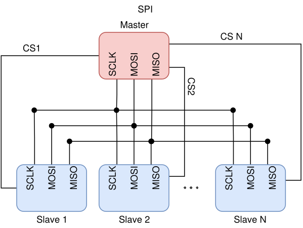

# Komunikacijski protokoli v mikrokrmilnikih

## Pregled vmesnikov

Za komunikacijo med mikrokrmilnikom in drugimi napravami, ki so priključene nanj potrebujemo nek komunikacijski vmesnik. Le-teh obstaja mnogo, med seboj pa se razlikujejo v hitrosti, številu naprav, ki jih lahko nanj povežemo, številu povezav, ki so potrebne za komunikacijo in kompleksnosti samega protokola. Najpogosteje se pri programiranju mikrokrmilnikov srečujemo z vmesniki UART, SPI in I2C, ki si jih bomo v nadaljevanju tudi podrobneje pogledali.

| Vmesnik | Način prenosa| Št. naprav | Št. povezav | Preverjanje podatkov |
| :-----: | :----------: | :--------: | :---------: | :------------------: |
| UART    | Asinhron     | 1 na vsaki strani | 2 | Da (pariteta) |
| SPI     | Sinhron      | 1 master in neomejeno slave | 3+1 za vsak slave | Ne
| I2C     | Sinhron      | <127| 2  | Ne |

## UART - Universal Asynchronous Receiver-Transmitter

Vmesnik UART za delovanje potrebuje 2 povezavi – to sta TX (oddaja) in RX (sprejem), ki jih med napravama povežemo križno. Na vsaki strani vmesnika se lahko nahaja največ ena naprava. Beseda asinhroni v kratici UART se nanaša na to, da se signal ure ne prenaša po posebnem vodniku, temveč ga vsaka naprava generira sama, kar pomeni, da mora biti takt ure na obeh straneh prednastavljen na pravo vrednost. V nasprotnem primeru komunikacija ni mogoča. Poleg hitrosti je potrebno nastaviti tudi način delovanja, ki ga ponavadi označimo v notaciji D/P/S (data/parity/stop) in nam pove število podatkovnih bitov (ponavadi 5-9), tip paritete (O – liha (odd), E – soda (even) ali N – brez paritete) in število stop bitov (1-2), ki jih bomo uporabili v posameznem podatkovnem okvirju.

Poglejmo si podatkovni okvir na realnem primeru prenosa črke "A" v načinu 8/O/1 in 8/E/1 (8 podatkovnih bitov, liha/soda pariteta in 1 stop bit) in hitrosti 9600 baud (perioda 104 µs).

Na zgornjih slikah lahko vidimo posnetek zaslona iz osciloskopa, ki prikazuje prenos črke A pri obeh načinih paritete. Isti signal je bil shranjen tudi v csv datoteki in ponovno izrisan na računalniku za lažji grafični prikaz.

Na začetku slike (čas **t < 0 µs**) lahko opazimo, da je privzeto stanje prenosne linije je visoka napetost (v mikrokrmilnikih ponavadi 3,3 V ali 5 V), kar izhaja iz časov telegrafije in služi temu, da v času čakanja oddajnik izkazuje svojo "živost" z oddajanjem visoke napetosti. V nasprotnem primeru namreč  ne bi bilo mogoče ločiti med okvarjenim ali čakajočim oddajnikom.

Pri času **t = 0 µs** se začne START bit (vedno logična 0). Ta prehod iz visoke na nizko napetost sprejemniku signalizira, da se začenja prenos podatkov.

Pri času **t = 104 µs** se začne prenos podatkov, ki je v našem primeru dolg 8 bitov. Biti si sledijo v zaporedju od najmanj pomembnega do najbolj pomembnega (Least Significant Bit – LSB first). Signal na sliki prikazuje prenos črke "A", ki ima ASCII desetiško vrednost 65, kar je v v dvojiškem zapisu 01000001. Če to zaporedje bitov primerjamo s tistim na sliki lahko opazimo, da je ravno obrnjeno, kar potrjuje prenos v zaporedju LSB first – ljudje namreč številke pišemo v zaporedju od najbolj pomembne do najmanj pomembne (MSB first).

Po koncu podatkovnih bitov (času **t = 936 µs**) se začne paritetni bit. Vrednost tega bita je odvisna od števila enic v podatkovnih bitih in izbranega načina paritete, lahko pa ga tudi sploh ni v primeru, da uporabljamo način brez paritete. Pri uporabi sode paritete, bo vrednost paritetnega bita taka, da je celotno število prenesenih enic sodo. To pomeni, bo pri sodem številu enic v podatkovnih bitih paritetni bit enak logični 0, pri lihem številu enic pa logični 1. Pri lihi pariteti se uporabi enaka logika vendar za liho število enic.
Paritetni bit je uporaben za zaznavo osamljenih napak pri prenosu. Če bi se namreč pri prenosu ena izmed enic spremenila v nič, bi to zaznali kot nepravilno vrednost paritetnega bita in bi tako vedeli, da sprejet podatkovni okvir ni uporaben. Žal pa z uporabo samo enega paritetnega bita ni mogoče zaznati več kot 1 napake pri prenosu, prav tako ne omogoča popravljanja napak na sprejemni strani.

Pri času **t = 1040 µs** se začne STOP bit (vedno logična 1) ta sprejemniku sporoča, da se je prenos zaključil in prenosno linijo povrne v privzeto stanje (visoka napetost). Število STOP bitov je lahko 1 ali 2, vendar se v sodobni digitalni elektroniki ponavadi uporablja le 1.

## SPI – Serial Peripheral Interface

Vmesnik SPI omogoča komunikacijo med eno “master” napravo in poljubnim številom “slave” naprav. Potrebni so 3 vodniki SCLK (ura), MOSI (Master Out Slave In), MISO (Master In Slave Out) in pa še en dodaten CS (Chip Select) vodnik za vsako “slave” napravo. Vodniku CS se lahko reče tudi SS (Slave Select) in se uporablja za izbiro "slave" naprave, ki bo trenutno aktivna. V nasprotuju z UART je vmesnik SPI sinhron, kar pomeni, da ima en vodnik namenjen prenosu ure, zato predhodna nastavitev le-te na obeh straneh ni potrebna, je pa vseeno potrebno nastaviti nekatere druge parametre prenosa in sicer polariteto ure (CPOL), fazo ure (CPHA) in zaporedje bitov (MSB/LSB).

| Mode | CPOL   | CPHA  |
|  --- |  :---: | :---: |
| Mode 0 |0 | 0 |
| Mode 1 | 0 | 1   |
| Mode 2 |  1   | 0|
| Mode 3 |  1   | 1 |

Polariteta ure se nanaša na privzeto oz. mirujoče stanje ure. Polariteta 0 pomeni, da je privzeto stanje nizka napetost, polariteta 1 pa visoka napetost
Faza ure se nanaša na čas spremembe in vzorčenja podatkovnega signala glede na signal ure. Faza 0 pomeni, da se podatkovni signal spremeni ob zadnjem robu (trailing edge) prejšnjega cikla ure in vzorči ob prvem robu (leading edge) trenutnega cikla ure. Pri fazi ure 1 se podatki spremenijo ob prvem robu trenutnega cikla ure in vzorčijo ob zadnjem robu istega cikla ure.

Kot prej si poglejmo podatkovni okvir SPI na realnem primeru prenosa črke "A". Prenos je bil opravljen pri frekvenci ure 100 kHz in v načinu 0 (MODE0) in zaporedju MSB first.

Na zgornji sliki lahko vidimo posnetek zaslona iz osciloskopa, ki prikazuje prenos črke A pri danih parametrih prenosa. Isti signal je bil shranjen tudi v csv datoteki in ponovno izrisan na računalniku za lažji grafični prikaz

Pri času **t < 0 µs** lahko opazimo, da je privzeto stanje signala ure (SCLK) nizka napetost, kar pomeni polariteto ure CPOL=0, kar je pravilno saj uporabljamo SPI v načinu 0 (CPOL=0, CPHA=0).

Pri času **t = 0 µs** se z prvim robom ure začne prenos podatkov. Ker je uporabljena polariteta ure 0 je prvi rob ure pozitivna fronta (prehod iz nizkega v visoko stanje), zadnji rob pa negativna fronta (prehod iz visokega v nizko stanje). V primeru uporabe CPOL=1 bi bila situacija ravno nasprotna. Pri času t=0 µs se že vzorči prvi prenesen bit.

Pri času **t = 5 µs** se zgodi prva sprememba podatkovnega signala in sicer iz vrednosti prvega bita (0) v vrednost drugega bita (1). To se zgodi ob zadnjem robu prvega cikla ure, kar potrjuje, da uporabljamo fazo ure CPHA=0.

Pri času **t = 10 µs** se ob prvem robu drugega cikla ure vzorči drugi preneseni bit, nato se pri zadnjem robu istega cikla podatki ponovno spremenijo in postopek se ponovi za vseh 8 bitov.
Iz slike lahko razberemo, da je bilo preneseno zaporedje bitov 01000001, kar v zaporedju MSB first ustreza desetiški številki 65, ki je ASCII vrednost prenesenega znaka "A".

## I2C (IIC) - Inter Integrated Circuit

Vmesnik I2C je tako kot SPI sinhroni, razlikuje pa se v tem, da omogoča komunikacijo med večimi "master" in večimi "slave" napravami preko le dveh povezav – SDA (podatki) in SCL (ura). Komunikacija je paketno komutirana, kar pomeni, da mora imeti vsaka naprava svoj naslov. Število mogočih naslovov predstavlja zgornjo mejo števila naprav, ki jih lahko povežemo med seboj. To je ponavadi 119 za 7 bitni naslovni prostor (8 naslovov je rezerviranih). V primeru, da je potrebnih več naprav se lahko uporabi tudi 10 bitni naslovni prostor.

Kot prej si poglejmo podatkovni okvir I2C na realnem primeru prenosa črke "A". Prenos je bil opravljen pri frekvenci ure 100 kHz, v smeri od "master" naprave proti "slave" napravi z naslovom 0x44.

Na zgornji sliki lahko vidimo posnetek zaslona iz osciloskopa, ki prikazuje prenos črke A pri danih parametrih prenosa. Isti signal je bil shranjen tudi v csv datoteki in ponovno izrisan na računalniku za lažji grafični prikaz

Pri času **t < 0 µs** lahko opazimo, da je privzeto stanje SDA in SCL vodnikov visoka napetost oz. logična 1.

Pri času **t = 0 µs** se podatkovna linija SDA spremeni iz visokega v nizko stanje. Prehod SDA iz visokega v nizko stanje medtem ko SCL ostane na visokem stanju se imenuje "start condition" in oznanjuje začetek prenosa.

Od časa **t = 2,8 µs** se prenese 7 bitni naslov "slave" naprave kateri je trenutni paket namenjen. Zaporedje prenosa bitov je MSB first, torej lahko iz slike razberemo da je paket namenjen napravi z naslovom 1000100, kar je v desetiškem 68 oz. šestnajstiškem sistemu 44.

Pri času **t = 75,1 µs** se začne R/W bit, ki označuje smer prenosa. V tem primeru ima vrednost 0, kar pomeni komunikacijo od "master" proti "slave". Vrednost 1 pa bi pomenila od "slave" proti "master"

Pri času **t = 85,4 µs** sledi bit ACK. Ta bit ne prihaja s strani naprave "master" temveč se v tem trenutki nadzor nad SDA preda napravi "slave". Z vrednostjo 0 "slave" sporoča, da je uspešno prejel sporočilo. Zaradi zakasnitev pri predaji nadzora nad SDA lahko takoj po končanem ACK bitu opazimo krajšo motnjo, ki pa ni kritična in ne vpliva na prenosa podatkov.

Pri času **t = 95,8 µs** se začne prenos podatkovnih bitov. Eden za drugim se v zaporedju MSB first prenese vseh 8 bitov poslane črke "A". Spremembe SDA signala so dovoljene le ko je ura v nizkem stanju, vzorčenje pa se zgodi ob pozitivni fronti urinega signala (prehod iz nizkega v visoko stanje). Medtem ko je ura v visokem stanju mora se signal SDA ne sme spreminjati, v nasprotnem primeru to pomeni neuspešen prenos. Če se to uresniči bo "slave"  po koncu podatkovnih bitov na SDA poslal logično 0 in s tem sporočil "masterju", da je bil prenos uspešen.

Pri času **t = 198 µs** se signal SDA spremeni iz nizkega v visoko stanje ob visokem stanju urinega signala. Ta prehod se imenuje "stop conditon" in pomeni konec prenosa in vrnitev SDA in SCL signalov v privzeto visoko napetostno stanje.
Ena izmed značilnosti vmesnika I2C je t.i. raztegovanje ure oz. "clock stretching". Po končanem prenosu osmih bitov in ACK znaka (188,7 us) bi lahko "slave" naprava držala signal SCL na nizki napetosti in s tem onemogočila napravi "master", da bi izvedla "stop condition". S tem "slave" sporoča, da potrebuje nekoliko več časa preden bo pripravljen na nov prenos podatkov.

## Gradiva
CSV datoteke zajetih signalov in pripadajočo python kodo lahko prenesete [tukaj](https://github.com/janvr1/Seminarska-KE/tree/master/janvr_kom_vmesniki) ali pa [tukaj (zip datoteka)](https://github.com/janvr1/Seminarska-KE/blob/master/janvr_kom_vmesniki.zip).
